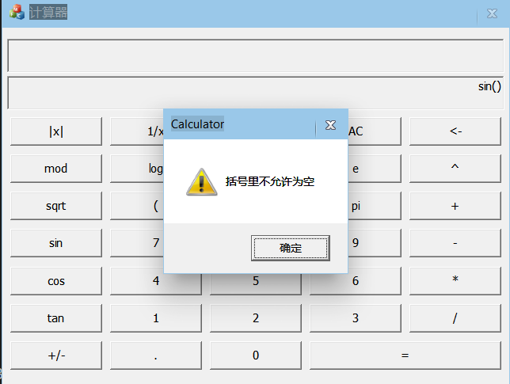

# SqyMathTools
---

本项目是使用C++编写的，在Windows平台上运行的，基于MFC的可视化数学工具箱，包含一个数学计算器和一个函数图像显示器，操作简单易懂，相关代码有清晰的注释

## 安装环境
---
- 操作系统：Windows10 1903

- IDE：Microsoft Visual Studio Community 2022

## 在本地运行
---

- 下载本项目，使用Visual Studio打开.sln文件，在解决方案中存在三个小项目：Calculator（计算器）、FunctionIndicator（函数图像显示器）、SqyMathLibrary（相关数学功能实现库）

- 请注意：其中SqyMathLibrary为静态库，被其他项目所引用，无法独立运行

- 用户可选择Calculator与FunctionIndicator为启动程序在本地运行，但是必须先构建SqyMathLibrary生成库文件才可以。

## 使用方法/示例
---
### Calculator（数学计算器）

1. 支持四则运算、三角函数、阶乘、绝对值、平方开方等常规计算，另外支持对复杂表达式的计算，如含有多个括号，不同优先级运算符之间的组合计算。


2. 由于采用double类型存放数据，为了保持一定的精度，该计算器最高支持1e+15以下的计算，高于等于1e+15的数字会直接显示INF，表示计算超出范围


3. 计算器在遇到错误表达式时会及时弹窗报错，并提供相应的错误原因





### FunctionIndicator（数学函数图像显示器）

1. 支持对普通X-Y函数、极坐标函数、参数方程等函数的操作，并可在主视图区绘制出相应的函数图像


2. 支持添加函数、修改函数、删除函数等常规功能，可自由设置函数定义域、图像精细度、图像颜色与线型多种参数。


3. 当前程序管理的函数表达式会显示在主视图右方区域中，在光标移至函数图像时会显示相应的函数图像坐标点，且在右下方的状态栏中显示光标所指的当前函数序号。


4. 程序支持鼠标滚轮进行图像的放缩操作，并且内置了移动模式，用户可设置移动模式，然后左键拖拽图像进行移动。


5. 可设置显示坐标轴，网格，刻度值，函数列表、函数信息


6. 支持单/多函数模式，在单函数模式下仅显示一个函数


## 项目代码解析
---
### SqyMathLibrary
1. 该项目是一个静态库，被Calculator和FunctionIndicator所使用，无法独立运行。该库非常关键，是其他两个可视化项目程序的后端数据支持，所有的实际数据计算都在库中实现

2. 该项目的代码禁止使用Windows下的API，按照C++98标准进行代码编写，仅使用STL，确保最大的代码可移植性，方便后续移植到linux平台。

3. 下面是项目的所有模块

 

4. 下面是对每个模块的简单介绍，按这个顺序查看源代码有助于理解

- MathDef:一些公用的预定义，包含一些数学运算需要的数值，如e，π等，还有一些错误字符串，被所有源文件所包含。

- MathOperator: 定义了数学运算符抽象基类，所有的具体运算符如加减乘除等都需派生该类，并实现相应的运算方法。

- MathOperatorMap: 建立了数学运算符类对象与运算符字符串的映射，并提供了相应方法去注册、获取、销毁数学运算符。

- Calculator: 实现了一个后台计算器，常规数学表达式计算。

- UNIFunction：定义了函数表达式和函数工具，实现函数表达式赋值操作。

- MathFunction：定义了一个可以在X-Y平面上显示函数图像的抽象基类，以及派生的具体的函数类，可借由该类计算函数图像点。

5. 计算器原理

- 计算器的实现本质上就是在中缀表达式转后缀表达式的过程中，利用运算数栈和运算符栈边计算边转换的过程,原理详解可参考自[中缀表达式 转成 后缀表达式](https://blog.csdn.net/zm_miner/article/details/115324206)


- 计算器的原理并不复杂，但是实现起来有几个难点：
（1）运算符类型多种多样，其优先级、运算方式各不相同。（2）有些运算符可能会在计算特殊值会出现错误，如除0，tan（π/2）
（3）运算过程由于用户输入的任意性，会导致各种错误，引发计算bug，难以预料


- 为了解决运算符的统一性问题，在项目中定义了一个运算符的**抽象基类（MathOperator）**，它具备了所有运算都具备的参数：优先级、运算符目数、运算符符号，
并且定义了一个运算符操作方法（Operate），该方法是一个纯虚函数，具体方法由各个具体运算符类实现。

``` C++
public:
//运算,方法交由子类实现，默认为双目运算格式，单目运算时只对b进行运算
        virtual OPERAND Operate(const OPERAND a, const OPERAND b) = 0;
private:  //类数据成员
        const std::string m_Symbol;  //运算符符号
        const size_t m_OptCount;  //运算符目数，现有单目、双目
        const size_t m_Priority;  //运算符优先级
```

- 运算符类继承体系利用了C++面向对象的思维解决了运算符类型多样化的问题，可以为每个运算符定义不同的运算方法，只需遵循相同操作接口即可，且可扩展性和维护性良好
  

 - 针对用户的输入是基于字符串的表达式，我们还必须设计一个由字符串到运算符的映射，后面就可以直接通过字符串取到相应的运算符对象进行操作，该方法由MathOperatorMap实现。


 - MathOperatorMap的设计采取单例模式，因为这种映射在系统中不应存在第二份实例。为了保证线程安全，采取了饿汉式，在程序初始化时就创建对象。
 **注意：由于全局对象和静态对象初始化顺序的不确定性，最好不要在其他全局对象构造函数中去使用该类提供的方法，否则可能出现问题。**

 ``` C++
 private:  //单例模式下不可显式构造
        MathOperatorMap();
        MathOperatorMap(const MathOperatorMap&) {};
        MathOperatorMap& operator=(const MathOperatorMap&) {};
        ~MathOperatorMap();  //析构函数私有，外部不能直接delete该对象
        
        
    private:
        static MathOperatorMap* m_Instance;  //对象实例指针
        std::unordered_map< std::string, MathOperator* > m_Map; //运算符类对象与运算符字符串的映射
```

 - 为了减少复杂的编码，在MathOperatorMap中向外提供了三个宏：注册运算符、获得运算符、销毁运算符，后续如果想要继续添加运算符，不必修改源代码，
 只需要创建类继承自运算符类（MathOperator），在类中实现运算符的必要功能，再调用这些宏即可。

``` C++
//注册数学运算符，key值默认为运算符的Symbol，若想使用非默认Symbol，请不要使用宏
#define REGISTER_MATH_OPERATOR(T) MathOperatorMap::GetInstance() -> Register<T>()

//获取数学运算符类对象
#define GET_MATH_OPERATOR(key) MathOperatorMap::GetInstance() -> GetMathOperator(key)

//销毁数学运算符
#define DESTROY_MATH_OPERATOR(key) MathOperatorMap::GetInstance() -> Destroy(key)
```

 - 通过MathOperatorMap，我们就成功建立了运算符与字符串的双向映射，获得了一个具体的运算符类对象我们就可以通过成员函数获得对应的字符串，
 获得了一个运算符字符串，我们可以通过宏获取在系统中注册的运算符类对象从而得到运算方法，对后续的编程相当方便。
  

 - Calculator在先前这些模块的基础上利用了[中缀表达式 转成 后缀表达式](https://blog.csdn.net/zm_miner/article/details/115324206)实现了一个后台计算器，在计算时一旦出现错误会将错误原因进行保存。
 但是其实现并不完全，他所接受的表达式（MathExpression）不是常规的字符串，而是一种字符串数组（std::vector<std::string>），需要外部输入时事先将运算符与运算数进行分离，该后台计算器只负责相应的计算部分。
 
 ``` C++
OPERAND Calculator::Calculate(const MathExpression& expression) {
		//检查表达式是否为空
		if (expression.empty()) {
			this->SetResult(false, CALC_ERROR_EMPTY_EXPR);
			return 0;
		}

		this->SetResult(true);  //初始化运算结果
		//遍历
		for (int i = 0; i < expression.size(); i++) {

			//不允许空括号存在，否则会导致计算bug
			if (i > 0 && expression[i - 1] == "(" && expression[i] == ")") {
				this->SetResult(false, CALC_ERROR_EMPTY_BRA);
				this->Reset();
				return 0;
			}

			if (this->IsNum(expression[i]) == true) {  //数字
				this->m_Nums.push(this->GetNum(expression[i])); //直接压栈
			}
			else if (this->IsOperator(expression[i]) == true) { //运算符
				MathOperator* opt = this->GetMathOperator(expression[i]);
				this->OptTackle(opt);
				if (this->IsSuccess() == false) {  //运算符处理失败，清空计算器并退出
					this->Reset();
					return 0;
				}
			}
			else {  //非数字非运算符
				this->SetResult(false, CALC_ERROR_EXPRESSION);
				this->Reset();
				return 0;
			}

		}

		//清算运算符，计算最终结果
		while (!this->m_MathOpts.empty()) {
			this->Operate();
			if (this->IsSuccess() == false) {
				this->Reset();
				return 0;
			}
		}

		//数字栈空间最终应只剩一个数字
		if (this->m_Nums.size() != 1) {
			this->SetResult(false, CALC_ERROR_EXCE_NUM);
			this->Reset();
			return 0;
		}

		OPERAND res = this->m_Nums.top();
		this->m_Nums.pop();

		return res;
	}
```

 6. 函数

 -  数学函数形式多样，不同函数自变量可能不同，因变量也可能不同，甚至对于类似分段函数或是参数方程的函数，还具备了多个函数表达式，这些在代码中必须加以区分和整合。
 
 - 在库中的**UniFunction**，已经事先定义了一个通用的函数表达式结构体（FunctionExpression）。它具备表达式、自变量、因变量、定义域等参数。
 
 ``` C++
  //通用函数表达式
    struct FunctionExpression {
        MathExpression m_Expression;  //具体表达式，其中含有自变量符号，无法直接计算
        char m_IV;  //因变量 
        char m_DV;  //自变量
        OPERAND m_Left, m_Right;  //自变量定义域区间，左右端点不可超过INF，默认为-INF~INF
        FunctionExpression(MathExpression& expression, char iv, char dv, OPERAND left = -INF, OPERAND right = INF);
    };
 ```

 - 函数表达式的设计采用数据和方法分开，他本身不具备任何方法，要想操作这些表达式，可以借由函数工具对这些参数实现相关的表达式自变量赋值计算。
  
  ``` C++
 //函数工具类，提供一系列的方法专门用以处理函数表达式
    class FunctionTool {
    public:  //类默认方法
        FunctionTool();

        //以下函数由编译器自动生成即可
        //~FunctionTool() {};
        //FunctionTool(const FunctionTool&) {};
        //FunctionTool& operator=(const FunctionTool&) {};
    public:
        //翻译函数表达式，将其中的自变量赋予特定值并返回一个具体的数学表达式
        MathExpression TranslateExpression(FunctionExpression& fe, OPERAND value);

        //将特定值代入函数表达式并计算，返回结果值，INV表示计算失败
        //注意，返回值INF是一个有效值，他表示无穷大，而不是此次计算失败
        OPERAND GetValue(FunctionExpression& fe, OPERAND parameter);

        bool IsSuccess(); //操作是否成功
        std::string GetError();  //操作运算失败原因
    private:
        void SetResult(bool res, std::string reason = ""); //设置操作成功与否
    private:
        bool m_Success;  //上一次操作的结果
        std::string m_Error;   //若上一次操作失败，会保存上一次操作失败的原因
        Calculator m_Calc;  //计算器
    }; 
```

 - 在库中的MathFunction中定义了一个可以在X-Y平面上显示图像的函数类，它是一个**抽象基类**，向外提供了基本操作接口，但需要子类实现,下面是该类的部分接口。
  
  ``` C++
class MathFunction{
 public:
        //计算特定区间上的所有X-Y平面上的函数点。第三个参数为函数点数量，它反应了函数点的精细度
        //注意，这里区间的定义并不固定，它视自变量的定义而改变，如普通函数则是在x上的区间，参数方程函数则是在t上的区间，极坐标函数是在角度上的区间
        //函数值有可能为INF，它是一个有效值，它表示该点在y轴上无定义
        //为了提高效率，返回值为FunctionMap的指针，该指针不用外部释放，若计算失败，则返回NULL
        FunctionMap* Calculate(OPERAND left, OPERAND right, size_t precision);

        FunctionType GetType();  //获得函数类型

        bool IsSuccess();  //操作是否成功 
        std::string GetError();   //操作运算失败原因

        //获得该函数的函数表达式，由于表达式可能不止一个，故返回一个链表，由子类实现具体代码
        virtual std::list<FunctionExpression> GetExpression() = 0; 

        //设置该函数的函数表达式，由于表达式可能不止一个，故参数为一个链表，由子类实现具体代码
        virtual void SetExpression(std::list<FunctionExpression> expressionList) = 0;
}
```

- 因为一个函数具备的表达式可能会有多个，类型也不一样，故在抽象基类中不设定内部的函数表达式，交由子类设定与处理，下面是该类的继承体系。
 
 


- 函数基类中的Calculate方法会通过传进来的计算范围和计算精度去计算范围内所有的函数图像点，该方法运用了设计模式的模板方法，计算框架已经在基类中实现，但其中的步骤如GetX、GetY是需要子类去实现，不同的子类有不同的实现。

``` C++
class MathFunction{
 protected://本类使用了模板方法，以下方法由子类实现，但无需由子类使用
        virtual bool IsValid() = 0;  //函数是否有效，必须由子类实现
        virtual void PreProcess() {}  //计算之前的预处理，没有则不必实现
        virtual OPERAND GetX(OPERAND parameter) = 0;  //获取函数自变量的某个值在x轴上的对应值，必须由子类实现，返回INV表示计算失败
        virtual OPERAND GetY(OPERAND parameter) = 0;  //获取函数自变量的某个值在y轴上的对应值，必须由子类实现，返回INV表示计算失败
        virtual void PostProcess() {} //计算之后的后处理，没有则不必实现
}

 FunctionMap* MathFunction::Calculate(OPERAND left, OPERAND right, size_t precision) {
		//FunctionMap res(precision+1);
		this->m_FM.clear();

		if (this->IsValid() == false) return NULL;  //函数无效，直接返回

		if (left >= right) {
			this->SetResult(false, FUNC_ERROR_DEF_RANGE);  //计算范围错误
			return NULL;
		}

		this->PreProcess();  //预处理

		//x-y极值初始化
		this->m_MinX = INF;
		this->m_MaxX = -INF;
		this->m_MinY = INF;
		this->m_MaxY = -INF;

		OPERAND unit = (right - left) / precision;  //函数计算单元

		int i = 0;
		for (OPERAND parameter = left; parameter <= right; parameter += unit) {

			OPERAND x = this->GetX(parameter);  //获取x值
			if (x == INV) {
				//res.clear();  
				return NULL;  //x值无效，直接返回
			}

			OPERAND y = this->GetY(parameter);  //获取y值
			if (y == INV) {
				//res.clear();  
				return NULL; //y值无效，直接返回
			}

			//更新X和Y的极值
			this->m_MaxX = std::max(this->m_MaxX, x);
			this->m_MinX = std::min(this->m_MinX, x);
			this->m_MaxY = std::max(this->m_MaxY, y);
			this->m_MinY = std::min(this->m_MinY, y);

			//添加函数点
			FunctionPoint fp;
			fp.first = x;
			fp.second = y;
			this->m_FM.push_back(fp);
		}

		this->PostProcess();  //后处理

		return &(this->m_FM);
	}
```

### CalCulator
1. 该项目是一个基于**MFC对话框架构**的数学计算器，满足各种复杂数学表达式的计算。

2. 下面是项目的所有模块

 

3. 下面是对每个模块的简单的介绍，按这个顺序查看源代码有助于理解

- CCalculatorDlg:该类继承了MFC的基础对话框类(DiaLogEx),提供了数学计算器的对话框界面，以及相关的按钮处理。

- CCalculatorApp:该类为应用程序类，没有特别的实现，仅为对话框程序的运行而存在。

4. 主要的计算功能交由SqyMathLibrary的Calculator处理，该项目主要负责与用户的交互和对话框界面的显示，以及保证输入后的表达式字符串能正确转换为计算器所需要的数学表达式（MathLibrary）。

### Function-Indicator

1. 该项目是一个基于**MFC单视图架构**的数学函数图像显示器，可以显示多种函数图像，包含多种功能，操作简单，便于上手。

2. 下面是项目的所有模块
 
 

3. 下面是对每个模块的简单的介绍，按这个顺序查看源代码有助于理解

- CFunctionDlg:该类是计算器中的CCalculator的对话框类移植过来的，用于提供一个输入函数表达式的对话框页面。该类重新排布了按钮布局，删除了等于按钮，新增了自变量按钮，它会根据当前输入的函数类型更改自变量符号。另外可向外部提供输入后的数学表达式和输入框字符串。

- CNormalFuncDlg:该类为对话框类，是特化专门为编辑普通函数的对话框。在该对话框中，用户可编辑普通函数表达式，设置函数定义域，以及图像精细度等其他参数设置，类内部会将这些参数进行保存，供后续使用。

- CPolarFuncDlg:该类为对话框类，是特化专门为编辑极坐标函数的对话框。功能与CNormalFuncDlg类似，但是会存在一些特殊的设定，比如自变量符号，图像显示范围，在该对话框界面中均有所提示

- CTwoFuncDlg:该类为对话框类，是特化专门为编辑参数方程函数的对话框。功能与CNormalFuncDlg类似，但表达式输入框会增加为两个。

- CSetXYRangeDlg:该类为对话框类，提供一个设置图像显示范围的对话框，功能较为简单。

- CFuncNumDlg:该类为对话框类，提供一个输入函数序号的简单对话框，后续的功能会用到它。

- FunctionIndicatorDoc:该类为Function-Indicator的文档类，负责程序中的数据存储、处理、中转等功能，以及所有菜单项ID的响应。

- FunctionIndicatorView:该类为Function-Indicator的视图类，专门负责在视图窗口进行绘图，他与文档类(Doc)会产生频繁的数据交互。

- MainFrm：主框架类，基于MFC基本架构，没有大的改动

- FunctionIndicator：主程序类，负责程序的运行，没有大的改动

4. 文档类（FunctionIndicatorDoc）详解
- 文档类在该项目中尤为重要，是程序处理流程核心，所有的程序数据都要流经它进行处理和分发。


- 其中保存了程序的诸多重要数据：如函数链表、函数数据链表。

``` C++
class CFunctionIndicatorDoc : public CDocument{
private:
	bool m_ShowEdge; //显示边框
	bool m_ShowAxis; //显示坐标轴
	bool m_ShowGrid; //显示网格
	bool m_Single;   //显示单个函数
	bool m_ShowFuncInfo;//鼠标接近函数线时显示其函数信息，包括函数点坐标和函数序号
	bool m_ShowFuncList; //在函数图像右侧显示函数表达式列表

	double m_MinX, m_MaxX; //当前x轴范围 
	double m_MinY, m_MaxY;//当前y轴范围
	MoveMode m_MoveMode;  //当前移动模式

	//函数链表，保存了所有添加的函数以及一系列可供调用的方法
	std::list<SML::MathFunction*> m_FunctionList;

	//绘制函数数据链表，仅保存绘制图像所需要的必要数据，用来提供View绘图，与函数链表一一对应
	std::list<DrawFuncData*> m_DrawDataList;  
}
```
- 函数数据（DrawFuncData）是在文档类中定义的结构体，其定义如下，他只包含绘图所需要的必要数据，确保视图与文档的高内聚和低耦合

``` C++
//绘制所需的必要函数数据，简化Doc与View的数据传输，保证View只绘画而不计算
struct DrawFuncData { 
	std::vector<CString> expressionStr;  //函数表达式字符串，由于可能表达式不止一个，故用一个数组存放
	SML::FunctionMap *drawPoint;  //函数绘制点
	size_t precision; //函数精细度
	int lineWidth;  //线宽
	int lineType;  //线型
	COLORREF lineColor;  //线颜色
};
```

- 在文档类中定义了枚举类型-移动模式（MoveMode），专门用于传递给视图类确定当前程序的移动状态，移动模式会在视图类的解析中详细解析。

 ``` C++
//移动模式
enum MoveMode {
	BAN, //禁止移动
	MOVE,  //允许移动
	MOVING  //正在移动
};
```

- 它也提供了诸多方法供外部调用：删除函数、清空函数、修改函数参数等。

``` C++
class CFunctionIndicatorDoc : public CDocument{
public:
	double GetMinX();  //获得x范围最小值
	double GetMaxX();  //获得x范围最大值
	double GetMinY();  //获得y范围最小值
	double GetMaxY();  //获得y范围最大值
	std::list<DrawFuncData*> GetDrawDataList();  //获得绘制函数所需的所有数据
	void SetRange(double minX, double maxX, double minY, double maxY);  //设置当前X-Y轴范围
	void UpdateFunction();  //更新函数，重新计算函数图像绘制点，仅对普通函数更新
	void DelFunction(int num); //删除特定序号函数，序号由1开始
	void ClearFunction(); //清空所有函数

	void AlterFunction(int num); //修改特定序号函数的参数，序号由1开始

	//修改链表中的普通函数
	void AlterNormalFunc(std::list<SML::MathFunction*>::iterator itFunc, std::list<DrawFuncData*>::iterator itDraw); 
	
	//修改链表中的极坐标函数
	void AlterPolarFunc(std::list<SML::MathFunction*>::iterator itFunc, std::list<DrawFuncData*>::iterator itDraw);  
	
	//修改链表中的参数方程函数
	void AlterTwoFunc(std::list<SML::MathFunction*>::iterator itFunc, std::list<DrawFuncData*>::iterator itDraw);  
	
	MoveMode GetMoveMode();  //获得当前移动模式
	void SetMoveMode(MoveMode mode);  //设置当前移动模式
	bool IsShowEdge(); //是否显示边框
	bool IsShowAxis(); //是否显示坐标轴
	bool IsShowGrid();  //是否显示网格
	bool IsShowFuncInfo(); //是否显示函数坐标点
	bool IsShowFuncList();  //是否显示函数列表
}
```

- 通过这些数据和方法，文档类实现了整个程序的数据处理，它会响应所有菜单项的消息并更新数据，数据更新后会及时提醒视图类更新视图，非常关键。

- 文档类不负责具体函数的计算，而是交由SqyMathLibrary中的函数类处理。

4. 视图类（FunctionIndicatorDoc）详解

- 该类仅保存绘图相关的必要数据，如绘图的范围、当前鼠标指向的函数序号等，其他重要数据均交由文档类保存，保持程序的高内聚和低耦合

``` C++
class CFunctionIndicatorView : public CView{
private:
	//在视图坐标系上绘制函数图像的区域坐标范围(真实坐标，非函数坐标)
	double m_Top, m_Bottom, m_Left, m_Right;
	MoveStatus m_MoveStart;  //移动模式下，鼠标一开始点击时的初始状态
	int m_CurFuncNum;  //当前鼠标位置指向的函数的序号
}
```

- 该类提供了多种绘图操作，以多个函数形式实现，架构清晰

``` C++
class CFunctionIndicatorView : public CView{
private:
	//实现x轴上的数值在不同坐标系的转换，第二参数为转换模式
	//true-表示视图坐标系到函数坐标系的转换
	//false-表示函数坐标系到视图坐标系的转换
	double TransformX(double x, bool mode);

	//实现y轴上的数值在不同坐标系的转换，第二参数为转换模式
	//true-表示视图坐标系到函数坐标系的转换
	//false-表示函数坐标系到视图坐标系的转换
	double TransformY(double y, bool mode);

	void SetShowWindow(); //设置函数图像的有效绘画区域
	void DrawEdge(CDC* pDC);  //画绘画区域的边框
	void MarkCoordinateValue(CDC* pDC); //标注坐标系的各个坐标值
	void DrawGrid(CDC* pDC);  //画绘画区域内的网格
	void DrawAxis(CDC* pDC); //画绘画区域内的X-Y坐标轴
	void DrawFunction(CDC* pDC);  //绘制函数图像
	void ShowFuncExpression(CDC* pDC);  //显示函数表达式 
	void AmplifyImage();  //放大坐标轴图像
	void ShrinkImage();  //缩小坐标轴图像
	void DoubleBufferDraw();  //利用双缓冲机制进行绘画，反正频繁绘画时的图像闪烁
	double GetDistacne(SML::FunctionPoint &a, SML::FunctionPoint &b);  //获得两个函数图像点的距离
	SML::FunctionPoint GetClosestPoint(CPoint point);  //获得离光标点最近的函数图像点，没有则返回INF点
	bool ShowFunctionPoint(CPoint point);  //在图像中显示光标所在的函数坐标点信息,false表示光标不在函数图像上
	void ShowFunctionNum();  //在状态栏中显示光标处的函数序号
	void ShowFunctionInformation(CPoint point);  //显示离光标点最近的函数的相关信息,包括函数点坐标和函数序号
	void ShowImagePoint(CPoint point);	//在状态栏显示光标所在的图像坐标
}
```

- 视图类提供了双缓冲绘画函数（DoubleBufferDraw）。[双缓冲绘画](https://blog.csdn.net/oceanlucy/article/details/46827809?utm_medium=distribute.pc_relevant.none-task-blog-BlogCommendFromMachineLearnPai2-7.nonecase&depth_1-utm_source=distribute.pc_relevant.none-task-blog-BlogCommendFromMachineLearnPai2-7.nonecase)
是一种基本的图形图像绘图技术，首先，它在内存中创建一个与屏幕绘图区域一致的对象，然后将图形绘制到内存中的这个对象上，最后把这个对象上的图形数据一次性地拷贝并显示到屏幕上。这种技术能够大大地提高绘图的速度，减少卡顿和闪屏的问题。

``` C++
void CFunctionIndicatorView::DoubleBufferDraw() {
	//下面采取了双缓冲机制进行动态绘图，防止图像闪烁

	CDC* pDC = GetDC();

	//创建一个内存中的显示设备
	CDC MemDC;
	MemDC.CreateCompatibleDC(NULL);

	//创建一个内存中的图像
	CBitmap MemBitmap;
	CRect rect;
	GetClientRect(&rect);
	MemBitmap.CreateCompatibleBitmap(pDC, rect.right, rect.bottom);

	//指定内存显示设备在内存中的图像上画图
	MemDC.SelectObject(&MemBitmap);

	//先用一种颜色作为内存显示设备的背景色
	MemDC.FillSolidRect(rect.left, rect.top, rect.right, rect.bottom, RGB(255, 255, 255));
	this->OnDraw(&MemDC);

	//将内存中画好的图像直接拷贝到屏幕指定区域上
	pDC->BitBlt(rect.left, rect.top, rect.right, rect.bottom, &MemDC, 0, 0, SRCCOPY);

	//释放相关资源
	ReleaseDC(pDC);
}
```

- 视图类还提供图像移动机制――移动模式。移动模式需要搭配鼠标左键按下、放开、移动消息使用，而且为了避免移动过程中的图像闪烁，还需要使用到双缓冲绘画。

``` C++
//画面移动时的状态数据
struct MoveStatus {
	CPoint point;   //当前鼠标点
	double minX, maxX;  //x轴范围
	double minY, maxY;  //y轴范围
};

void CFunctionIndicatorView::OnLButtonDown(UINT nFlags, CPoint point)
{
	CFunctionIndicatorDoc* pDoc = GetDocument();
	SetCapture();  //鼠标捕获,保证之后的光标移动即使离开当前窗口区域也能响应鼠标消息

	//当前允许移动
	if (pDoc->GetMoveMode() == MOVE) {
		pDoc->SetMoveMode(MOVING); //设置移动模式为正在移动

		//保存移动初始状态
		this->m_MoveStart.point = point;
		this->m_MoveStart.maxX = pDoc->GetMaxX();
		this->m_MoveStart.minX = pDoc->GetMinX();
		this->m_MoveStart.maxY = pDoc->GetMaxY();
		this->m_MoveStart.minY = pDoc->GetMinY();
		
		::SetCursor(LoadCursor(NULL, IDC_SIZEALL));  //设置光标
	}

	CView::OnLButtonDown(nFlags, point);
}


void CFunctionIndicatorView::OnLButtonUp(UINT nFlags, CPoint point)
{
	CFunctionIndicatorDoc* pDoc = GetDocument();

	//当前正在移动，且左键被放开
	if (pDoc->GetMoveMode() == MOVING) {
		pDoc->SetMoveMode(MOVE); //设置移动模式为正在移动

		::SetCursor(LoadCursor(NULL, IDC_HAND));  //设置光标

		//计算当前光标位置与初始状态光标位置的相对位移，需要将数值转换为函数坐标系
		double valueX = this->TransformX(point.x, true) - this->TransformX(this->m_MoveStart.point.x, true);
		double valueY = this->TransformY(point.y, true) - this->TransformY(this->m_MoveStart.point.y, true);

		//设置新的x-y范围
		pDoc->SetRange(this->m_MoveStart.minX - valueX, this->m_MoveStart.maxX - valueX,
			this->m_MoveStart.minY - valueY, this->m_MoveStart.maxY - valueY);

		//更新函数
		pDoc->UpdateFunction();
		
		//刷新绘画
		this->Invalidate();
		this->UpdateWindow();
	}

	ReleaseCapture(); //释放鼠标捕获
	CView::OnLButtonUp(nFlags, point);
}


void CFunctionIndicatorView::OnMouseMove(UINT nFlags, CPoint point)
{

	//显示当前光标图像位置
	this->ShowImagePoint(point);

	CFunctionIndicatorDoc* pDoc = GetDocument();

	//当前移动模式为正在移动
	if (pDoc->GetMoveMode() == MOVING) {
		::SetCursor(LoadCursor(NULL, IDC_SIZEALL));  //设置光标

		//计算当前光标位置与初始状态光标位置的相对位移，需要将数值转换为函数坐标系
		double valueX = this->TransformX(point.x, true) - this->TransformX(this->m_MoveStart.point.x, true);
		double valueY = this->TransformY(point.y, true) - this->TransformY(this->m_MoveStart.point.y, true);

		////设置新的x-y范围
		pDoc->SetRange(this->m_MoveStart.minX - valueX, this->m_MoveStart.maxX - valueX,
			this->m_MoveStart.minY - valueY, this->m_MoveStart.maxY - valueY);

		//更新函数
		pDoc->UpdateFunction();

		//双缓冲绘画
		this->DoubleBufferDraw();
	}
	
	//当前为允许移动模式，仅设置光标
	if (pDoc->GetMoveMode() == MOVE) {
		::SetCursor(LoadCursor(NULL, IDC_HAND));
	}

	//显示函数信息
	this->ShowFunctionInformation(point);

	CView::OnMouseMove(nFlags, point);
}
```

## 参考资料

- [Calculator_Qt](https://github.com/QiTianyu-0403/Calculator_Qt)

- [mfc数学函数曲线绘制程序](https://gitee.com/rewine/mfcplot#https://gitee.com/link?target=https%3A%2F%2Fblog.csdn.net%2Foceanlucy%2Farticle%2Fdetails%2F46827809%3Futm_medium%3Ddistribute.pc_relevant.none-task-blog-BlogCommendFromMachineLearnPai2-7.nonecase%26depth_1-utm_source%3Ddistribute.pc_relevant.none-task-blog-BlogCommendFromMachineLearnPai2-7.nonecase)

- [中缀表达式 转成 后缀表达式](https://blog.csdn.net/zm_miner/article/details/115324206)

## 作者

- [@苏青羽](https://github.com/suqingyu123456)

## 证书

[MIT](https://choosealicense.com/licenses/mit/)